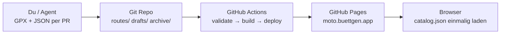
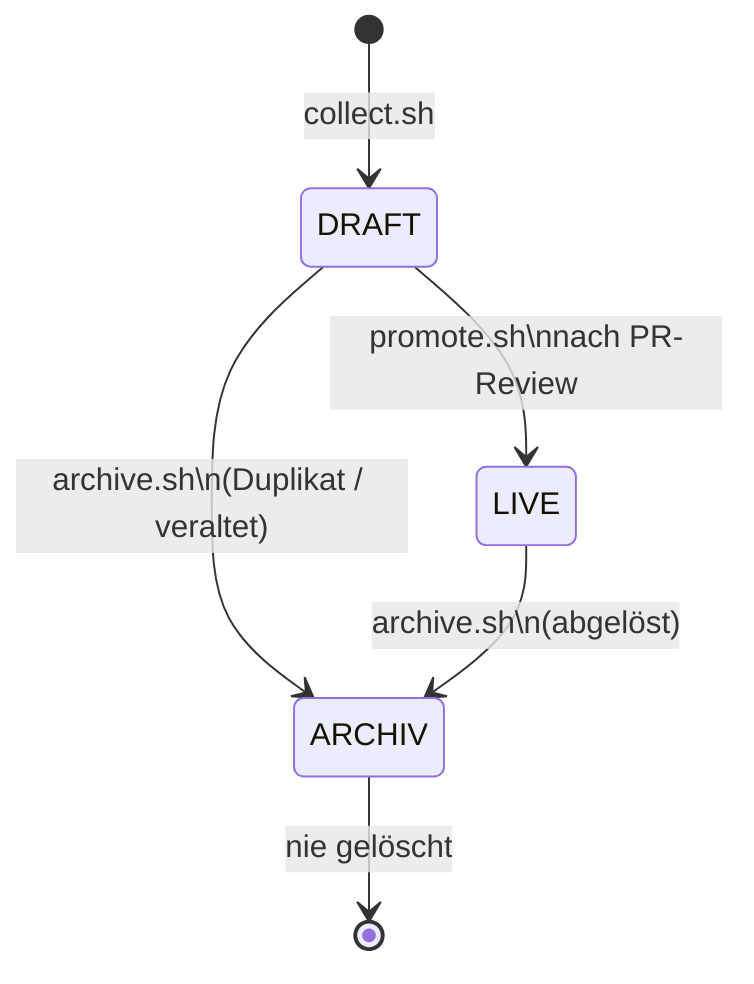
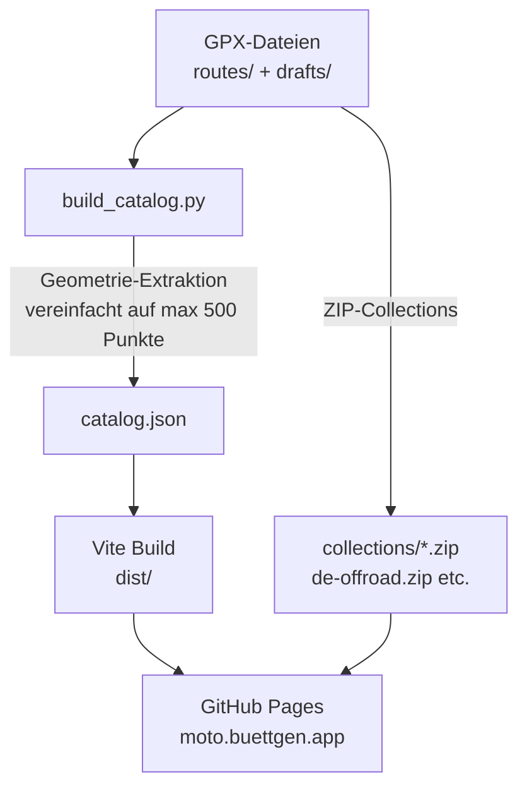

# Architektur

## Überblick

MotoAtlas ist eine **Pure-Static**-Anwendung. Es gibt keinen laufenden Server und keine Datenbank. Git ist die einzige Source of Truth. GitHub Actions ist das einzige "Backend".



## Routen-Lifecycle



| Zustand | Pfad                   | Sichtbar auf Site     | GPX-Download |
| ------- | ---------------------- | --------------------- | ------------ |
| DRAFT   | `drafts/{land}/`       | Ja, mit "Draft"-Badge | Nein         |
| LIVE    | `routes/{land}/{typ}/` | Ja, vollständig       | Ja           |
| ARCHIV  | `archive/{land}/`      | Nein                  | Nein         |

## Build-Pipeline



`catalog.json` enthält für jede Route:

- Alle Metadaten aus dem JSON-Sidecar
- Vereinfachte Geometrie (GeoJSON LineString) aus der GPX-Datei
- Berechnete Stats (distance_km, elevation_gain_m, bounds)

Der Browser lädt **eine einzige Datei** und rendert alles sofort — kein Warten, keine weiteren Requests.

## Frontend: Hash-Navigation

```
moto.buettgen.app/          → Katalog-View (Route-Cards, Filter, Collections)
moto.buettgen.app/#/map     → Karten-View (MapLibre GL, alle Routen als Layer)
```

Hash-Routing funktioniert auf GitHub Pages ohne Server-Konfiguration.

## CI/CD: Drei Workflows

| Workflow                      | Trigger                             | Zweck                                        |
| ----------------------------- | ----------------------------------- | -------------------------------------------- |
| `validate.yml`                | PR auf `routes/**` oder `drafts/**` | GPX + Sidecar validieren, Duplikat-Check     |
| `agent-review.yml` _(Plan 3)_ | Nach validate.yml                   | KI-Review, Rating schreiben                  |
| `build-deploy.yml`            | Push auf `main`                     | Katalog bauen, Vite-Build, gh-pages deployen |

## Warum kein Server?

- Null Wartungsaufwand, keine Kosten
- Alles versioniert in Git (inkl. History jeder Route)
- GitHub Actions als vollständiges CI/CD-System
- Kompromiss: Keine Echtzeit-Community-Ratings (kommt in Phase 2 via Supabase)
